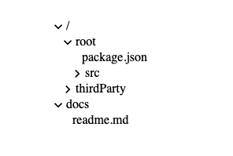
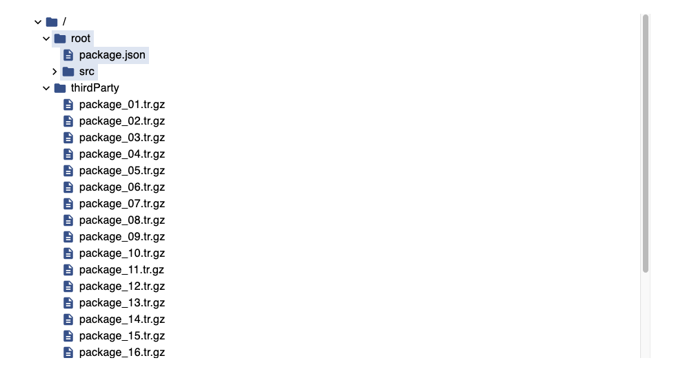

<!-- SPDX-FileCopyrightText: TNG Technology Consulting GmbH <https://www.tngtech.com> -->
<!-- SPDX-FileCopyrightText: Leslie Lazzarino <leslie.lazzarino@tngtech.com> -->
<!-- SPDX-FileCopyrightText: Benedikt Richter <benedikt.richter@tngtech.com> -->

<!-- SPDX-License-Identifier: Apache-2.0 -->

# ash-tree

**Disclaimer:** This project is in a very early stage and not yet production-ready. 

The current package provides an easy to use, extremely flexible and performant (virtualized) tree implementation in React. 
A one-size-fits-all tree, so to speak. It is meant to be used as a low-level UI component that can be customized to
fit the needs of the user. It is not meant to be a full-fledged file explorer, but it can be used as a basis for one.

## API

The package exposes the React component **AshTree** with the following API:

* nodes: The nodes of the tree
    * It is a recursive data structure that allows to define the nodes of the tree and their relations.
    * Example: `{root_folder: {child_folder: {file_in_child_folder.txt: 1}, file_in_root_folder.txt: 1}}`.
* selectedPath: Path that is currently selected.
* expandedPaths: Set of path that are currently expanded. Example: `{"/root/src/"}`.
* onSelect: Callback that is invoked when selecting a node of the tree.
* onToggle: Callback that is invoked when a node of the tree is toggled.
* getTreeNodeLabel: Callback that returns the React component that is responsible for rendering a node of the tree.
* isFileWithChildren: A predicate that returns whether a node is a file with children. Such items are sorted 
* alphabetically between the files but otherwise behave like folders.
* cardHeight: The height of a node in pixel.
* maxHeight: The maximum total height of the tree in pixel.


## Examples
The following shows a simple example to get started with (here we omit most styling that can be highly customized):



It is produced by the following code (we omitted some unimportant details; for details, see `src/Components/BasicTree/BasicTree.tsx`):


```
import { AshTreeExport as AshTree } from 'ash-tree';


function BasicTree(): ReactElement {
  const [selectedPath, setSelectedPath] = useState<string>('/');
  const [expandedPaths, setExpandedPaths] = useState<Set<string>>(
    new Set(['/']),
  );

  function handleToggle(nodePathsToExpand: Set<string>): void {
   ...
  }

  function handleSelect(
    event: React.ChangeEvent<unknown>,
    nodePath: string,
  ): void {
    setSelectedPath(nodePath);
  }

  return (
    <AshTree
    expandedPaths={expandedPaths}
    isFileWithChildren={(path: string): boolean => Boolean(path)}
    onSelect={handleSelect}
    onToggle={handleToggle}
    nodes={testNodes}
    selectedPath={selectedPath}
    getTreeNodeLabel={
      (nodeName, node, nodePath): ReactElement => (
        <div style={{ lineHeight: '20px', fontSize: '16px' }}>
          {nodeName || '/'}
        </div>
      )
    }
    cardHeight={20}
    maxHeight={500}
    />
  );
}
```

The styling can be adjusted; see the following example (`src/Components/FancyTree`):



This is licensed under Apache-2.0.
